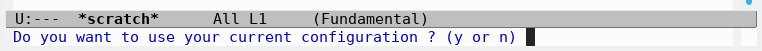

# Emacs Make and Configuration System (EMaCS)

Traditionally [GNU Emacs](https://www.gnu.org/software/emacs/) uses the `.emacs` [initialization file](https://www.gnu.org/software/emacs/manual/html_node/emacs/Init-File.html) and the `.emacs.d`  
[DotEmacsDotD](https://www.emacswiki.org/emacs/DotEmacsDotD) directory, both located in the user `$HOME` directory. The [programmer itch](http://www.catb.org/~esr/writings/taoup/)  
comes this time from the need to share the same configuration files for running different  
versions and compilations of [GNU Emacs](https://www.gnu.org/software/emacs/). Current workarounds found were some scripts for  
renaming `.emacs.d` directory, let's better make [GNU Emacs](https://www.gnu.org/software/emacs/) itself deal with this task.

EMaCS will **backup** your current [initialization file](https://www.gnu.org/software/emacs/manual/html_node/emacs/Init-File.html) renaming it to `init-user-backup.el`:

-   `$HOME/.emacs` -&gt; `$HOME/init-user-backup.el`  
-   `$HOME/.emacs.el` -&gt; `$HOME/init-user-backup.el`  
-   `$HOME/.emacs.d/init.el` -&gt; `$HOME/.emacs.d/init-user-backup.el`  
-   `$XDG_CONFIG_HOME/emacs/init.el` -&gt; `$XDG_CONFIG_HOME/emacs/init-user-backup.el`

EMaCS will **overwrite** your current [initialization file](https://www.gnu.org/software/emacs/manual/html_node/emacs/Init-File.html) with the project's `src/init.el`:

-   `src/init.el` -&gt; `$HOME/.emacs`  
-   `src/init.el` -&gt; `$HOME/.emacs.el`  
-   `src/init.el` -&gt; `$HOME/.emacs.d/init.el`  
-   `src/init.el` -&gt; `$HOME./config/emacs/init.el`

The `user-emacs-directory` directory (any of `$HOME/.emacs.d` or the [XDG-compatible](https://specifications.freedesktop.org/basedir-spec/basedir-spec-latest.html)  
`$XDG_CONFIG_HOME/emacs`) that [GNU Emacs](https://www.gnu.org/software/emacs/) [decides](https://www.gnu.org/software/emacs/manual/html_node/emacs/Find-Init.html#Find-Init) to use is modified by EMaCS to store  
different user customizations for each version and build of [GNU Emacs](https://www.gnu.org/software/emacs/).

EMaCS will **create** a custom `user-emacs-directory` directory at run time using relevant  
information concerning the version and the build for each instance of [GNU Emacs](https://www.gnu.org/software/emacs/)  
runned. EMaCS will always set the `user-emacs-directory` variable into the [XDG-compatiblea](https://specifications.freedesktop.org/basedir-spec/basedir-spec-latest.html)  
directory `$XDG_CONFIG_HOME/emacs` (defaults to `$HOME/.config/emacs`) with the value  
`.emacs.<version>-<build>-<date>`. Full path:  
`$XDG_CONFIG_HOME/emacs/.emacs.<version>-<build>-<date>`.

## Running different versions and builds of Emacs

The EMaCS [initialization file](https://www.gnu.org/software/emacs/manual/html_node/emacs/Init-File.html) `src/init.el` will be shared for running many different  
versions and builds of [GNU Emacs](https://www.gnu.org/software/emacs/). EMaCS provides the main [GNU Emacs](https://www.gnu.org/software/emacs/) [initialization file](https://www.gnu.org/software/emacs/manual/html_node/emacs/Init-File.html)  
`src/init.el`, that will be the new `user-init-file` config file for all [GNU Emacs](https://www.gnu.org/software/emacs/)  
versions and builds in the system. The same [initialization file](https://www.gnu.org/software/emacs/manual/html_node/emacs/Init-File.html) `src/init.el` will be used  
with different `user-emacs-directory` drectories, all created at runtime relying on the  
version and build of the instance of [GNU Emacs](https://www.gnu.org/software/emacs/) runned.

We recommend against modifying the EMaCS [initialization file](https://www.gnu.org/software/emacs/manual/html_node/emacs/Init-File.html) `src/init.el`, any custom  
configurations may be done in any of the configuration files (`custom-profile.el` or  
`custom-packages.el`) included in the specific `user-emacs-directory` directory.

## Compiling Emacs from source code.

EMaCS provides the `bin/emacs-compile.sh` script to compile [GNU Emacs](https://www.gnu.org/software/emacs/) from source code.

# Quick start

## EMaCS Clone

EMaCS project is hosted in [gitlab.com](https://gitlab.com/):

-   Git clone the EMaCS `lll-emacs-config` repository

    ``` shell
    git clone https://gitlab.com/lll-tools/emacs/lll-emacs-config.git
    cd lll-emacs-config
    make help
    ```

EMaCS provides a default `Makefile` with PHONY targets.

-   Execute `make` or `make help` for a list of the available options.

    ``` shell
    make
    ```

-   Execute `make check-local` to search and show the existing [GNU Emacs](https://www.gnu.org/software/emacs/) [initialization file](https://www.gnu.org/software/emacs/manual/html_node/emacs/Init-File.html)  
    in the system and the action to be executed for installation of the `src/init.el`.

    ``` shell
    make check-local
    ```

-   Execute `make info-local` to search and show the existing [GNU Emacs](https://www.gnu.org/software/emacs/) config files in the system.

    ``` shell
    make info-local
    ```

## EMaCS Install

**Install** the files needed to run the current [GNU Emacs](https://www.gnu.org/software/emacs/) installed in the system using the EMaCS  
[initialization file](https://www.gnu.org/software/emacs/manual/html_node/emacs/Init-File.html) `src/init.el`.

-   Execute `make install-data-local`:

    ``` shell
    make install-data-local
    ```

    -   **Backup** the current `user-init-file` (any of `$HOME/.emacs` or `$HOME/.emacs.el` or  
        `$HOME/.emacs.d/init.el` or `$XDG_CONFIG_HOME/emacs/init.el`) as `init-user-backup.el`  
        in the same location of the current `user-init-file` found.  
    -   **Copy** the EMaCS [initialization file](https://www.gnu.org/software/emacs/manual/html_node/emacs/Init-File.html) `src/init.el` file as the current `user-init-file`.  
    -   **Copy** custom configuration init files into the [XDG-compatible](https://specifications.freedesktop.org/basedir-spec/basedir-spec-latest.html) directory  
        `$XDG_CONFIG_HOME/emacs` (defaults to `$HOME/.config/emacs`).
        -   Copy the EMaCS file `./src/init-first-run.el` to the [XDG-compatible](https://specifications.freedesktop.org/basedir-spec/basedir-spec-latest.html) directory.  
        -   Copy the EMaCS file `./src/init-profile.el` to the [XDG-compatible](https://specifications.freedesktop.org/basedir-spec/basedir-spec-latest.html) directory.  
        -   Copy the EMaCS file `./src/init-packages.el` to the [XDG-compatible](https://specifications.freedesktop.org/basedir-spec/basedir-spec-latest.html) directory.  
        -   Copy the EMaCS file `./src/init-sources.el` to the [XDG-compatible](https://specifications.freedesktop.org/basedir-spec/basedir-spec-latest.html) directory.  
        -   Copy the EMaCS file `./src/init-dev.el` to the [XDG-compatible](https://specifications.freedesktop.org/basedir-spec/basedir-spec-latest.html) directory.

**Un-install EMaCS**, revert the [initialization file](https://www.gnu.org/software/emacs/manual/html_node/emacs/Init-File.html) to the previous `user-init-file` value.

-   Execute `make clean-local` to revert the installation of EMaCS in the system.

    ``` shell
    make clean-local
    ```

    -   **Restore** the `init-user-backup.el` as the current `user-init-file`.  
    -   **Remove** the `init-user.el`, if it exists.

## EMaCS First Run

The first time that you run any version of [GNU Emacs](https://www.gnu.org/software/emacs/) available in the system using the  
installed EMaCS [initialization file](https://www.gnu.org/software/emacs/manual/html_node/emacs/Init-File.html) `src/init-el`, it will ask if the  
`init-user-backup.el` should be used.  


-   **YES**, EMaCS will copy the backup of the user current configuration  
    `init-user-backup.el` to the file `init-user.el` and will load it at startup using it  
    with the `$XDG_CONFIG_HOME/emacs/.emacs.<version>-<build>-<date>` directory as  
    `user-emacs-directory`. Any other custom init files provided by EMaCS will NOT be  
    used.  
-   **NO**, EMaCS will not load the current user configuration `user-init-file` at startup  
    and will use the EMaCS custom init files installed in the [XDG-compatible](https://specifications.freedesktop.org/basedir-spec/basedir-spec-latest.html) directory.
    -   `$XDG_CONFIG_HOME/emacs/init-first-run.el`  
    -   `$XDG_CONFIG_HOME/emacs/init-profile.el`  
    -   `$XDG_CONFIG_HOME/emacs/init-packages.el`

## EMaCS Make (GNU Emacs Clone)

-   Execute `make install-exec-local` to clone the [GNU Emacs](https://www.gnu.org/software/emacs/) source code repository.

    -   Git clone [GNU Emacs](https://www.gnu.org/software/emacs/) source code in `./emacs` directory.

        ``` shell
        make install-exec-local
        ```

-   Execute `make install` to do both `make install-data-local` and `make install-exec-local`.  
    This is only available after using the provided autotools script `autobuild.sh`.

    ``` shell
    ./autobuild.sh
    make install
    ```

# EMaCS run details

GNU Emacs [customizations](https://www.gnu.org/software/emacs/manual/html_node/emacs/Saving-Customizations.html) for standard options.

EMaCS installation `make install-data-local` will **copy** the `init-first-run.el` file in  
the XDG-compatible directory.

EMaCS `init.el` will **load** the `init-user.el` file if it exists.

EMaCS `init.el` will **search** for the `init-first-run.el` file with common customizations  
to **import** them and **create** a new `custom.el` file in the `user-emacs-directory`  
directory the first time that any new GNU Emacs environment is runned.

EMaCS `init.el` will **load** the `custom.el` file located in the `user-emacs-directory`  
created.

-   custom.el, location  
-   default.el, (site-lisp) location  
-   site-start.el, (site-lisp) location

EMaCS `init.el` will **create** the `custom-profile.el` and `custom-packages.el` files in the  
`user-emacs-directory` directory for the user to add specific customizations.

Only files located in the specific `user-emacs-directory` should be modified.

## First Run Customizations

`init-first-run.el` saved to `custom.el`

## Load Profile

`init-profile.el` loaded from `custom-profile.el`

## Load Packages

`init-packages.el` loaded from `custom-packages.el`

# EMaCS Configuration

## User init

When the file `init-user.el` is found, not any other custom init file is loaded.  
Use the current user configuration with the specific `user-emacs-directory`.

## First Run Customizations

When the file `init-first-run.el` is found, defined customizations are saved to the  
`custom.el` file.  
Use `M-x customize` to add new.

## Profile

When the file `init-profile.el` is found, the file `custom-profile.el` is created to add new.  
Define your key bindings, macros and alias.

## Packages (using Melpa)

When the file `init-packages.el` is found, the file `custom-packages.el` is created to add new.  
Define your preferred packages.

## Packages (using Source)

When the file `init-sources.el` is found, the file `custom-sources.el` is created to add new.  
Define the packages used from source, NOT from melpa.

## Development

When the file `init-dev.el` is found, the file `custom-dev.el` is created to add new.  
Define your Elisp modules (el modes) under development.

# EMaCS Make GNU Emacs

-   Run the compilation script.

    ``` shell
    ./bin/emacs-compile.sh
    ```

-   Run new compiled Emacs.

    ``` shell
    ./emacs/src/emacs
    ```

# Contributions

<https://gitlab.com/lll-tools/emacs/lll-emacs-config/-/issues>

# Release life-cycle

1.  **checkout** `dev` branch  
2.  **create** and **checkout** new `release/vx.y.z` branch  
3.  **reset** (mixed) `release/vx.y.z` branch to `vx.y` branch
    1.  Discard "`dev` branch only" files and `ChangeLog` file  
    2.  Update `ChangeLog` file with changes to show in `master` branch  
4.  **commit** `release/vx.y.z` branch  
5.  **checkout** `vx.y` branch  
6.  **merge** (probably ff) `release/vx.y.z` branch into `vx.y` branch  
7.  **checkout** `dev` branch  
8.  **tag** `dev` branch with `tags/vx.y.z`  
9.  Repeat this loop (Steps 1-8) any times before merge into `master` branch  
10. **checkout** `master` branch  
11. **merge** (–squash) `vx.y` branch
    1.  Fix merge conflicts  
12. **commit** `master` branch
    1.  Fix squash merge message (release/vx.y.z)  
13. **checkout** `vx.y` branch  
14. **merge** `master` branch into `vx.y` (should be empty)  
15. **checkout** `master` branch  
16. **push** `master` branch into origin  
17. **checkout** `dev` branch
    1.  Fork release x.y (when required)  
    2.  Bump version x.y.z to next release  

## Only when new fork from previous release

1.  **merge** (–no-commit –no-ff) `vx.y` branch into `dev` branch
    1.  Remove ChangeLog file from merge (ours)  
    2.  Commit merge (should be empty)
